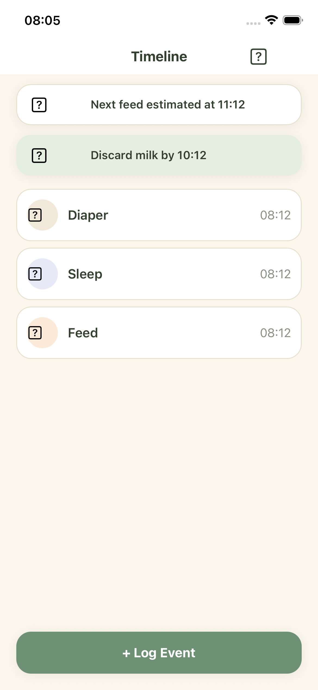
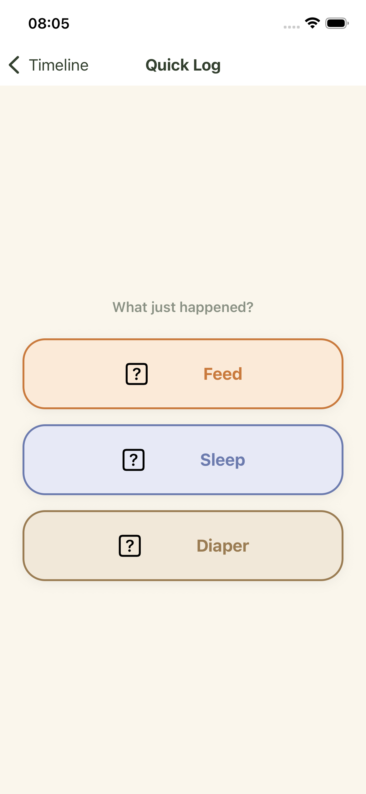
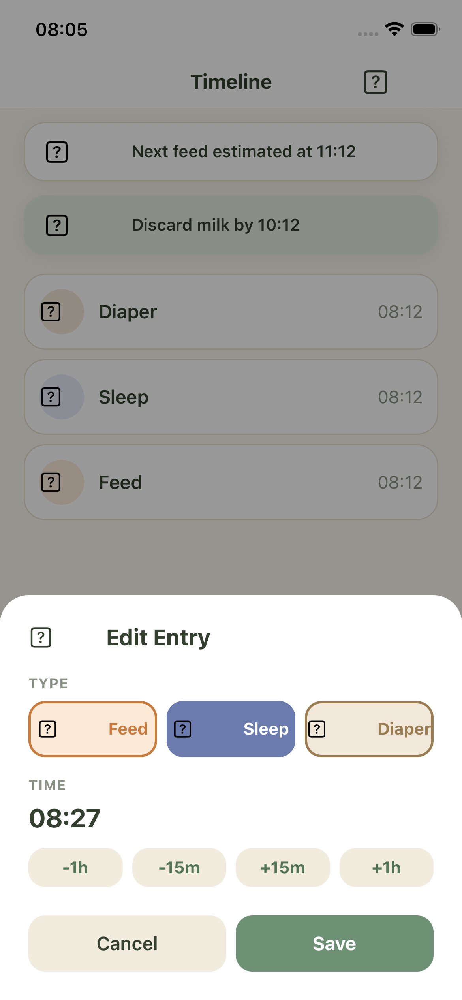
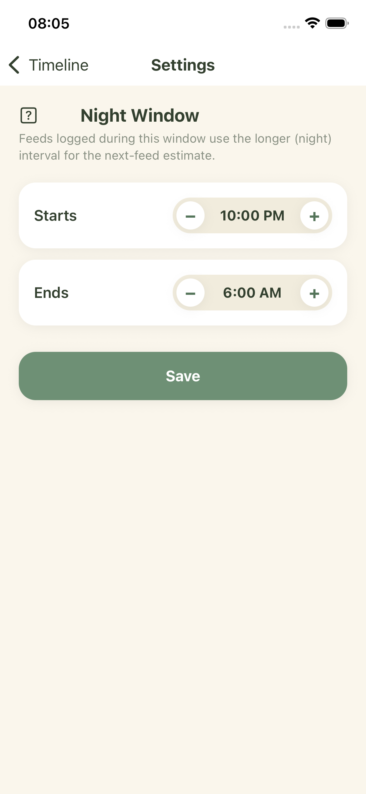

# DinoPamper

An app to track baby data and trends — for personal use only, security concerns are not considered.

## Features

- **Timeline** — chronological list of today's feed/sleep/diaper events, tap any entry to edit its type or time
- **QuickLog** — one-tap logging for Feed, Sleep, or Diaper
- **Settings** — configure the night-feeding window (used to pick day vs. night feed intervals)
- Next-feed time estimate and milk-expiry banner on the Timeline, based on your last feed
- Local-only storage (SQLite), no account, no sync

| Timeline | QuickLog | Edit | Settings |
| --- | --- | --- | --- |
|  |  |  |  |

## Getting started

```bash
npm install
npm start
```

Then choose a platform (requires previous setup) from the CLI/browser UI, or run one directly:

```bash
npm run ios      # iOS simulator
npm run android  # Android emulator
npm run web      # browser
```

## What's next

Not yet built, in rough order of likelihood:

- Photo/video attachments on entries
- Multi-day history / trend views
- Milestone tracking, growth charts
- Export

Not planned: accounts/auth, multi-device sync.
